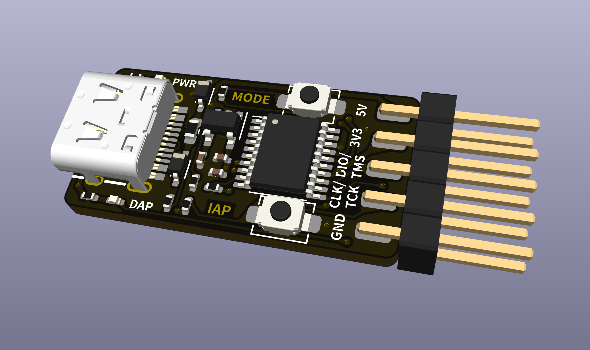

# WCH-LinkE-Nano

 自制WCH-LinkE

## 使用教程

1. 准备好一个WCH-Link，可以考虑我之前制作的[这款](https://oshwhub.com/erbw_s/wch-link)。

   > 这个下载器需要另一个wch-link才可以自制，很麻烦所以我一开始没考虑，但是下载速度的确很快

2. 直接打开`3.Software`文件夹内的`WCH-LinkUtility.exe`

3. 载入`2.Firmware`内的`.bin`文件并烧录

4. 断电重新上电即可作为正常WCH-LinkE使用

5. 持续按住MODE键上电，等待一段时间后松开可在`Link-RV`和`DAP`模式中切换
